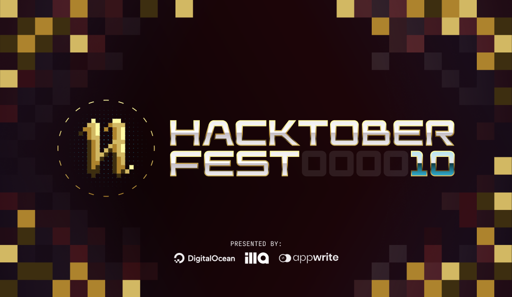

# Hacker's Hive

Welcome to the GitHub repository for our open-source programming blog. This repository serves as the central hub for our blog's content, code, and collaboration. 

## About Us

We are a community of programming enthusiasts, ranging from students to seasoned developers, who are passionate about open-source technology and programming. Our blog is dedicated to sharing knowledge, insights, and tutorials to help developers of all levels.

## Hacktoberfest 2023 is finally here 

Hacktoberfest, started by DigitalOcean, is celebrating its 10th anniversary this year 🥳 It is an annual event that celebrates open-source software development by having developers actively contribute to open-source projects. As of last year alone, there were over 147,000 participants.

### What is Hacktoberfest?
Hacktoberfest is an event to encourages developers to contribute to open-source projects. Contributors are encouraged to make four valid pull/merge requests to public and participating repositories to be eligible for digital rewards. It provides an opportunity for developers, both new and experienced, to engage with open-source projects and make meaningful contributions.

## How to Contribute

We believe in the power of open collaboration, and we welcome contributions from the broader programming community. Here's how you can get involved:

- **Write Articles**: If you'd like to contribute an article or tutorial, please fork this repository, create a new branch for your work, and submit a pull request. We encourage a diverse range of topics.

- **Suggest Ideas**: Have a great idea for a blog post or improvement? Open an issue and let us know. We value your input.

- **Report Issues**: If you encounter any issues with our blog content or code, please report them by opening an issue. We appreciate your help in keeping our blog error-free.

- **Spread the Word**: Enjoy our content? Help us reach a wider audience by sharing our blog posts with your network.

- **More detailed Contribution guidelines in [CONTRIBUTING.md](https://github.com/Grimm-s-Alchemy-Chamber/hackers_hive/blob/main/CONTRIBUTING.md)**

- **Don't forget to star this repository.**

## Blog Topics

**LOW OR NON CODE CONTRIBUTIONS**

At its core, Hacktoberfest aims to encourage more individuals to participate in open source and collaborate to enhance the software driving our world today. Open source projects can benefit greatly from community contributions, and there are a multitude of ways to get involved that don’t involve coding skills. Whether you possess technical expertise or not, you can leverage your professional skills to support open-source projects. In line with last year’s effort, we’re committed to promoting contributions that don’t require technical knowledge.

Low-code and non-code contributions are an excellent way to get involved in supporting open source. Here are some examples of ways you can contribute to open-source projects:

**LOW-CODE CONTRIBUTIONS:**
- Technical documentation
- User experience testing
- Technical blog post or tutorial
- Case studies

**NON-CODE CONTRIBUTIONS:**
- Writing
- Translating
- Copy editing
- Social media
- Blog posts
- Graphic design

## Contact Us

We value your feedback, questions, and ideas. You can reach out to us by opening an issue in this repository.

Thank you for being a part of our open-source programming community. Let's learn, code, and innovate together!

